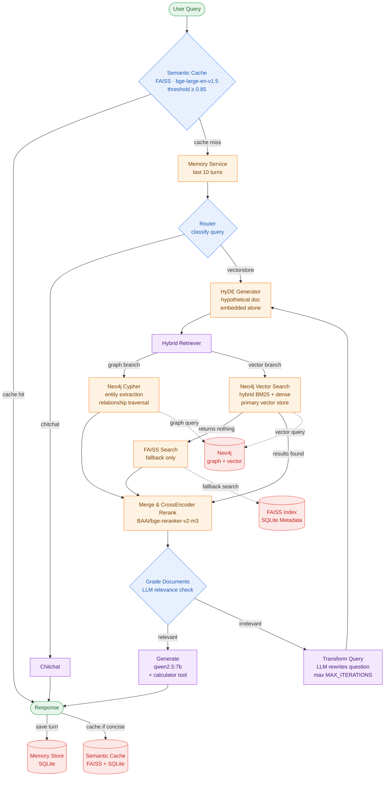

# Agentic Graph-RAG: Hybrid Knowledge Retrieval & Multi-Step Reasoning

> A fully local, production-ready RAG system that fuses Neo4j knowledge graph traversal with FAISS vector search — solving the hallucination, context fragmentation, and multi-hop reasoning failures that vector-only RAG cannot address.

---

## Overview

Standard vector RAG finds semantically similar passages. It cannot find the relationship between two entities, trace a multi-hop connection across documents, or know when retrieved documents are insufficient and ask a better question.

This system addresses all three. Neo4j serves as the primary store for both jobs — structured Cypher traversal for entity relationships, and hybrid BM25 + dense vector search for semantic similarity. FAISS and SQLite exist as a fallback layer if Neo4j vector search returns nothing or Neo4j is unavailable. The merged results are reranked by a CrossEncoder before reaching the LLM. If the grader determines the documents don't contain the answer, the query is rewritten and the cycle repeats.

The key architectural distinction from Project 1 (Agentic RAG): the intelligence here comes from the graph traversal layer — Neo4j surfaces relational facts that vectors never could — rather than from a multi-step planning loop. The pipeline is intentionally simpler; the retrieval is intentionally richer.

---

## Architecture



### Pipeline nodes

The **Semantic Cache** intercepts every query before the agent runs. If a sufficiently similar question has been answered before (cosine similarity ≥ 0.85), the cached answer is returned in milliseconds without touching the LLM or the retrieval pipeline.

The **Router** classifies the query as either chitchat (handled directly) or a retrieval question (routed into the hybrid pipeline). This avoids spending a full retrieval-generation cycle on greetings or off-topic messages.

The **HyDE Generator** produces a short hypothetical answer to the user's question. That synthetic document is embedded instead of the raw query — embedding the hypothetical document alone, not concatenated with the original query. This is the correct HyDE implementation: it moves the embedding into the answer space of the corpus rather than the question space.

The **Hybrid Retriever** runs two branches. The graph branch extracts named entities from the query via an LLM, then runs a Cypher query against Neo4j to find direct and reverse entity relationships (e.g. "M. Hamel - TALKED_ABOUT -> French Language"). The vector branch queries Neo4j's built-in hybrid vector search (BM25 sparse + dense embeddings) — Neo4j is the primary vector store, not just the graph store. If Neo4j vector search returns nothing, the retriever automatically falls back to the local FAISS index. All results from both branches feed into the reranker.

The **CrossEncoder Reranker** (`BAAI/bge-reranker-v2-m3`) rescores all merged candidates with a full attention matrix over each `[query, document]` pair and returns the top-K. The top document score is logged on every query.

The **Document Grader** evaluates whether the reranked documents actually contain enough context to answer the question. If they do, the pipeline proceeds to Generate. If they don't, the query is passed to Transform Query.

**Transform Query** rewrites the user's question into a standalone, search-optimised form using the LLM, then sends it back to HyDE for a fresh retrieval pass. This cycle repeats up to `MAX_ITERATIONS` times before forcing a response regardless.

**Generate** assembles the merged graph context and vector chunks, then calls qwen2.5:7b with a mode-appropriate system prompt. The calculator tool is bound at this node and invoked inline if the LLM determines arithmetic is needed.

---

## Hybrid Retrieval — Why Neo4j Does Both Jobs

Vector search finds relevant passages. It does not find relevant facts.

If you ask "what is the relationship between X and Y?", vector search returns chunks that mention X or Y. The Neo4j graph returns the actual edge between them — extracted during ingestion, stored as a typed relationship, and retrieved via Cypher traversal at query time.

Neo4j serves as the primary store for both retrieval types in this system. For vector search, it uses its built-in hybrid search mode — BM25 sparse retrieval combined with dense embedding similarity — which runs directly against the embeddings stored on Document nodes. For graph retrieval, it runs Cypher queries to traverse entity relationship edges. Both happen in the same database, which means the graph context and the vector context are retrieved from a single connected store rather than two separate systems.

FAISS and SQLite serve as the fallback layer. If Neo4j vector search returns no results — because the Neo4j vector index hasn't been populated yet, or because Neo4j itself is unavailable — `RetrieveService` automatically falls back to the local FAISS index. The system continues working in that state, just without the hybrid BM25+dense advantage and without graph context.

The ingestion pipeline reflects this dual role: `ingest_graph_watch.py` extracts named entities, creates Neo4j nodes and relationship edges, and also indexes document embeddings into Neo4j's vector store. `ingest_vector_watch.py` populates the FAISS fallback index in parallel.

---

## Tech Stack

| Component | Technology |
|---|---|
| Agent orchestration | LangGraph |
| Backend API | FastAPI |
| Primary store — graph + vector | Neo4j (Cypher traversal + hybrid BM25/dense vector search) |
| Fallback vector store | FAISS + SQLite |
| LLM + embeddings | Ollama — qwen2.5:7b, mxbai-embed-large |
| Reranker | BAAI/bge-reranker-v2-m3 (CrossEncoder) |
| Semantic cache encoder | BAAI/bge-large-en-v1.5 |
| Memory store | SQLite |
| Frontend | Chainlit |

---

## Project Structure

```
backend/
├── agents/
│   └── graph_agent.py          # LangGraph state machine
├── core/
│   ├── config.py               # Pydantic settings from .env
│   ├── logger.py
│   └── exceptions.py
├── services/
│   ├── graph_service.py        # Neo4j connection, entity extraction, Cypher queries
│   ├── retrieve_service.py     # Hybrid retrieval — Neo4j + FAISS + reranker
│   ├── memory_service.py       # SQLite-backed conversation memory
│   ├── semantic_cache_service.py
│   └── embed_cache_service.py
├── tools/
│   ├── embedder.py             # Ollama embedding client
│   ├── reranker.py             # CrossEncoder wrapper
│   ├── query_expander.py       # HyDE document generation
│   └── calculator.py           # LangChain tool for arithmetic
├── models/
│   ├── request_models.py       # QueryRequest — mode, bypass_cache fields
│   └── response_models.py
├── scripts/
│   ├── ingest_vector_watch.py  # File watcher — token chunks into FAISS (fallback store)
│   └── ingest_graph_watch.py   # File watcher — semantic chunks, coreference resolution, 
|   |                           # entity extraction, Neo4j graph + vector indexing, APOC merge
│   ├── ingest_multi_docs.py  
│   └──  convert_meta_to_sqlite.py
│                               
└── main.py                     # FastAPI app, lifespan, /query endpoint

frontend/
└── chainlit_app.py             # Chat UI, voice support, action buttons, file upload

docker-compose.yaml             # Neo4j container
```

---

## Getting Started

### Prerequisites

- Docker and Docker Compose (for Neo4j)
- Ollama running locally with the required models pulled:

```bash
ollama pull qwen2.5:7b
ollama pull mxbai-embed-large
```

### Setup

Start Neo4j:

```bash
docker-compose up -d
```

Copy and configure the environment file:

```bash
cp .env.example .env
```

Key settings to verify: `NEO4J_URI`, `NEO4J_PASSWORD`, `OLLAMA_MODEL`, `RERANKER_MODEL`, `SEMANTIC_CACHE_THRESHOLD`.

Start the file watchers (run in separate terminals — one for vector ingestion, one for graph ingestion):

```bash
python backend/scripts/ingest_vector_watch.py --watch knowledge
python backend/scripts/ingest_graph_watch.py --watch knowledge
```

Start the application:

```bash
# Backend
uvicorn backend.main:APP --host 0.0.0.0 --port 8000
or
python -m uvicorn backend.main:APP --host 0.0.0.0 --port 8000 --reload

# Frontend (separate terminal)
chainlit run frontend/chainlit_app.py --port 8001
```

Drop PDF or TXT files into the `knowledge/` directory. Both watchers will detect new files and ingest them into their respective stores automatically.

API docs available at `http://localhost:8000/docs`.

---

## Engineering Notes

**Graph compiled once** — `GraphRAGAgent.__init__` compiles the LangGraph state machine once and stores it as `self._app`. Earlier versions rebuilt the graph on every `query()` call — a silent performance bug with no error output.

**HyDE correctness** — the hypothetical document is embedded alone, not concatenated with the raw query. Concatenation anchors the embedding to the question space rather than the answer space, defeating the purpose of HyDE.

**JSON parsing robustness** — the router and grader nodes parse LLM JSON output. The `_invoke_json` helper strips markdown code fences before parsing to prevent silent fallback to default values when the model wraps output in ` ```json ``` ` blocks.

**Neo4j vector indexing** — `add_graph_documents()` only writes entity nodes and relationship edges. It does not embed document text. Without an explicit `Neo4jVector.from_documents()` call during ingestion, `Neo4jVector.from_existing_graph()` finds no embeddings and vector search silently returns empty results on every query — causing the system to always fall back to FAISS. `graph_service.index_documents_to_neo4j()` is called after every `add_graph_documents()` to ensure the vector store is populated. Both calls use the same `index_name="document_vector_index"` — this must match or `from_existing_graph` cannot find the embeddings.

**Three-tier entity disambiguation pipeline** — entity extraction quality in Neo4j depends on consistent node naming across chunks. The ingestion pipeline addresses this at three layers. Tier 1 is a strict extraction prompt on `LLMGraphTransformer` that instructs the LLM to always use the most specific name form and never merge distinct entities that share a partial name ("M. Hamel" and "C. Hamel" are different people). Tier 2 is post-ingestion APOC Jaro-Winkler merge — after writing to Neo4j, entity node pairs with similarity above 0.92 are merged via `apoc.refactor.mergeNodes`, folding formatting variants ("M Hamel" + "M. Hamel") into a single canonical node while preserving all relationships. Threshold 0.92 catches spacing and punctuation variants without merging distinct entities like "M. Hamel" and "C. Hamel" (score ~0.81). Tier 3 is LLM coreference resolution before extraction — each chunk is rewritten to replace pronouns and partial names with full canonical forms ("He said" → "M. Hamel said") before the graph transformer ever sees it. This is the only tier that handles alias disambiguation because it requires reading context.

**Semantic chunking for graph ingestion** — `ingest_graph_watch.py` uses `SemanticChunker` instead of `RecursiveCharacterTextSplitter`. SemanticChunker embeds every sentence and splits where cosine similarity between adjacent sentences drops below the 85th percentile, producing chunks that are complete thoughts rather than arbitrary token windows. This directly improves entity extraction quality because `LLMGraphTransformer` reads one chunk at a time — a split mid-idea means the LLM sees incomplete context and may extract wrong relationships from both halves. `ingest_vector_watch.py` continues using fixed token chunking because for pure vector search, consistent chunk sizes with overlap are fine.

**Graceful degradation** — if Neo4j is unavailable at startup, `GraphService` init fails and `graph_service` is set to `None`. `RetrieveService` detects this and falls back to FAISS-only retrieval for both vector search and graph context. The system continues working without Neo4j — it just loses the hybrid BM25+dense vector advantage and all entity relationship context until Neo4j comes back.

**Lifespan context manager** — service initialisation and teardown use the FastAPI `lifespan` async context manager, not the deprecated `on_event` hooks. All services with a `close()` method are shut down cleanly on container stop.

**Thread-safe memory** — `MemoryService` uses `threading.RLock()` for safe concurrent access across FastAPI worker threads, with SQLite in WAL mode for durable persistence.

**Semantic cache bypass** — the cache is skipped when `mode=detailed`, `temperature > 0.1`, `max_tokens` exceeds the default, or `bypass_cache=True`. Without these conditions, action buttons requesting detailed or creative responses would silently return the same cached concise answer regardless of the parameters sent.

---

## Configuration

All settings are in `.env` and mapped through `backend/core/config.py` via Pydantic Settings. Key parameters:

| Setting | Default | Notes |
|---|---|---|
| `OLLAMA_MODEL` | `qwen2.5:7b` | Generation model |
| `MAX_TOKENS` | `1024` | Generation token budget |
| `MAX_ITERATIONS` | `7` | Max Transform Query retries |
| `TOP_K_RETRIEVAL` | `5` | Documents returned after reranking |
| `RERANKER_INITIAL_K` | `15` | Candidates fetched before reranking |
| `SEMANTIC_CACHE_THRESHOLD` | `0.85` | Cosine similarity cutoff for cache hits |
| `USE_HYDE` | `true` | Enable HyDE query expansion |
| `SEMANTIC_CHUNK_BREAKPOINT` | `85` | Percentile threshold for semantic chunking splits |
| `SEMANTIC_CHUNK_THRESHOLD_TYPE` | `percentile` | SemanticChunker breakpoint type |
| `USE_COREF` | `true` | Enable LLM coreference resolution during graph ingestion |

---

## Future Improvements

- **Graph Community Detection** — implement hierarchical community clustering (similar to Microsoft's GraphRAG) to enable global map-reduce summarisation for broad thematic questions.
- **Async database drivers** — migrate Neo4j and SQLite connections to `neo4j.AsyncGraphDatabase` and `aiosqlite` to maximise FastAPI's event loop efficiency under concurrent load.
- **Evaluation framework** — integrate RAGAS scores to measure retrieval precision and answer faithfulness programmatically rather than by observation.
- **Faster coreference resolution** — replace the LLM coreference pass with a dedicated lightweight model (FastCoref, NeuralCoref) to reduce ingestion time on large corpora without sacrificing entity disambiguation accuracy.

---

## Author

**Shreyash Gaur** — AI Engineer
